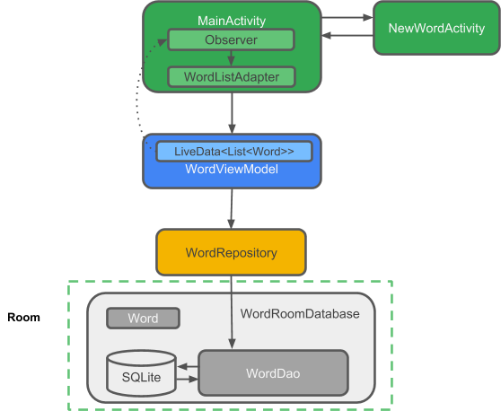

## Architecture Components

* Entidade: Ao trabalhar com o Architecture Components, esta é uma classe anotada que descreve uma
tabela de banco de dados.

* Banco de dados SQLite: No dispositivo, os dados são armazenados em um banco de dados SQLite.
Para simplificar, opções de armazenamento adicionais, como um servidor da Web, são omitidas.
A biblioteca de persistência de ambientes cria e mantém esse banco de dados para você.

* DAO: objeto de acesso a dados. Um mapeamento de consultas SQL para funções. Você costumava definir
isso meticulosamente em sua SQLiteOpenHelperaula. Quando você usa um DAO, você chama os métodos
e o Room cuida do resto.

* Banco de dados da sala: camada de banco de dados no topo do banco de dados SQLite que cuida de
tarefas comuns que você usou para lidar com um SQLiteOpenHelper. Detentor de banco de dados que
serve como um ponto de acesso ao banco de dados SQLite subjacente. O banco de dados do Room usa
o DAO para emitir consultas ao banco de dados SQLite.

* Repositório: Uma classe que você cria, por exemplo, usando a WordRepositoryclasse. Você usa o
Repositório para gerenciar várias fontes de dados.

* ViewModel: Fornece dados para a interface do usuário. Atua como um centro de comunicação entre
o Repositório e a interface do usuário. Oculta onde os dados são originados da interface do usuário.
As instâncias do ViewModel sobrevivem às mudanças na configuração.

* LiveData: Uma classe de suporte de dados que pode ser observada . Sempre mantém / armazena em cache
a versão mais recente dos dados. Notifica seus observadores quando os dados foram alterados.
LiveDataestá ciente do ciclo de vida. Os componentes da interface do usuário apenas observam
dados relevantes e não param ou retomam a observação. O LiveData gerencia automaticamente tudo
isso desde que está ciente das alterações relevantes no status do ciclo de vida durante a
observação.

### [Fonte:Google](https://codelabs.developers.google.com/codelabs/android-room-with-a-view/#0)